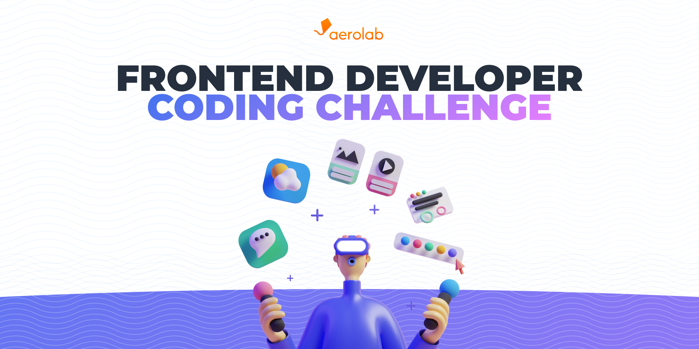

# Aerolab Frontend Developer coding challenge

The challenge is to build a catalog view for a loyalty program app. We’ll provide you with the base UI and API, you can use it as provided or you can make any improvements you deem fit. It’s up to you, your imagination and your skills to come up with new solutions and/or interactions between the components.

Remember that the product’s main goal is to help users redeem items through a points-based system. We expect your end-product to be both visually attractive and functionally effective.

* [Acceptance Criteria](#Acceptance-Criteria)
* [Tech Stack](#Tech-Stack)
* [Design resources](#Design-resources)
* [API Documentation](#API-Documentation)
* [Delivery](#Delivery)
* [Aerolab career opportunities](#Aerolab-careers-opportunities)

## Acceptance Criteria

Users have an undetermined amount of points accumulated, and each product is worth a set amount of points. We’ll test the product you submit, along with the code it is written in, and any additional interactions or layers you’d like to add.

We want to see how your code’s UI interacts with different states and user interactions, so your product should comply with the following guidelines

(Keep in mind that the jury will also take into account the quality of the submitted code. Simply meeting this criteria doesn’t mean your solution will be the best)

Feel free to reach one of the following levels of quality based on your skills. Show us what you can do and what you are an expert at! 💪

### Level 1 - It works! ⚙️

- Make a desktop version
- Each product should have a visible price in points.
- Link to the project GitHub repository (footer)
- The user should be able to sort products by price, from highest to lowest, and vice-versa.
- The user should be able to see how many points they have in their account.
- There should be a clear way for the user to distinguish those products that they can redeem from those they cannot.
- A “Redeem” button should be available for those products that the user has enough points to claim.
- A “Redeem now” option should appear when the user interacts with a product that they have enough points to claim.
- When the user doesn’t have enough points for a product, they should be able to see how many more points they need to claim it.
- The user should not be able to redeem a product for which they don’t have enough points.
- When the user clicks on the Redeem now button, the system should automatically deduct the item’s price from the users’ points.
- The user should be able add points to their account

### Level 2 - Eye Candy 💅

- *All of above*
- Make a mobile responsive version
- The "view all products" button (on Hero/Header section) should scroll view to listed products
- Make the "Browse, Choose, Enjoy" section
- Put all your effort into making the site look beautiful
- Pay attention to details and the design system we provide you
- The user should be able to filter products by category
- The user should be able to use the pagination to view more listed products

### Level 3 - Mind-blowing 🤯

- *All of above*
- Make a tablet responsive version
- Make some visual tweaks (animations, micro interactions, etc)
- Put all your effort on website performance (images, web vitals, network optimization, etc)
- Be careful about SEO (metadata, markup semantics, SSR, etc.)
- Be careful about Accesibility (keyboard navigation, narrator, markup semantics, etc.)
- Be careful about environment variables security
- If you want you can make some unit or integration tests

## Tech Stack

We recommend that you use the following technologies, which are aligned with the daily work we do at Aerolab 🪁 and which in this case we believe are also adequate to solve the challenge.

### We recommend

- [**NextJS**](https://nextjs.org/) (SSR framework)
- [**Styled JSX**](https://github.com/vercel/styled-jsx) or [**Styled Components**](https://styled-components.com/) (styles)
- [**Vercel**](https://vercel.com/) (deploy)

### Optionally

- *Typescript (data types)*
- *Jest + React Testing Library (testing)*

> 😎 You can use any additional library you need to carry out the challenge.

> 👍 BTW, we can be flexible if you feel comfortable with any other technology or if you want to combine them in different ways. You can use other stack like *CRA, VueJS, NuxtJS, Remix, Svelte, Angular, React Native, Flutter, Heroku, Digital Ocean, Stitches CSS, Styled JSX, SASS, CSS Modules,* etc...

## Design resources

We've crafted a beautiful design for this coding challenge. We provide your a Figma access to all of resources like, views, design systems, responsive adaptations, typography, styles, and more.

- [Figma design here](https://www.figma.com/file/3O7BxHFnSSawJeny3lXWkE)

## API Documentation
- Read our [API Documentation](https://aerolabchallenge.docs.apiary.io/)
- [Claim your API token](https://aerolab.co/coding-challenge) and have access to endpoints (type `join` and write your **email**. Then you'll receive some details and the API token)

## Delivery

This needs to ship. You should upload the project to a public link (we recommend [Vercel](https://vercel.com/)). You should also upload it to Github so we can review the code.

In case you need a hand in getting your site to go live, we recommend you read the [Vercel Docs](https://vercel.com/docs/concepts/deployments/overview) to help you out.

🚀 Once your code is ready send the public link and repository link via email to whoever sent it to you from Aerolab, or you can apply at https://aerolab.co/jobs if you got here some other way.

> _If you feel uncomfortable building fancy user interfaces then try our [alternative challenge](https://github.com/Aerolab/fullstack-developer-coding-challenge) (Disclaimer: we'll prioritize the original challenge)_

---

## Aerolab

Aerolab is a Digital Product Studio based in Buenos Aires, Argentina.

We design and develop top-tier websites and apps for startups and leading brands.

Our goal is to find talented, creative developers.

For us, this challenge is a fun way of reaching devs and testing out their skills.

We are remote-first!

## Aerolab careers opportunities

### 👩‍💻 Are your looking for a remote developer job?

We are open to work! We have remote positions for Frontend and Fullstack developers but also there are positions for Product Designers, Project Managers and more! Feel free to apply at https://aerolab.co/jobs

## Follow us!

Follow Aerolab on social networks

- [Twitter](https://twitter.com/aerolab)
- [Instagram](https://www.instagram.com/aerolab/)
- [Dribbble](https://dribbble.com/aerolab)
- [Behance](https://www.behance.net/aerolab)
- [Linkedin](https://www.linkedin.com/company/aerolab-digital)

About Us

- [See our case studies](https://aerolab.co/projects)
- [Read our articles](https://medium.com/aerolab-stories)
- [Know more about our experience](https://aerolab.co/expertise)
- [Visit our website](https://aerolab.co/)

🪁
