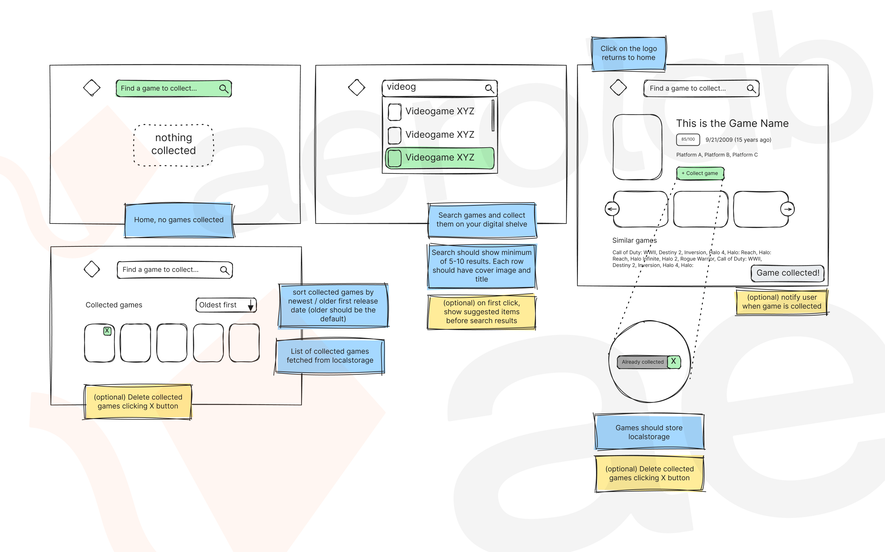

# Aerolab Coding Challenge (for frontend developers)

> Check out our 2022 coding challenge [here](https://github.com/Aerolab/frontend-developer-coding-challenge/tree/2022)

* [Overview](#Overview)
* [Tech Stack](#Tech-Stack)
* [IGDB API](#IGDB-API)
* [Requirements](#Requirements)
* [Design resources](#Design-resources)
* [Delivery](#Delivery)
* [About Aerolab and career opportunities](#Aerolab)

## Overview

Your task is to create a web application that allows users to search for and digitally collect video games, using the IGDB API and browser/device storage. The project must be built using the Next.js App Router. Styling is flexible, but we recommend using Tailwind CSS or CSS Modules. The final product should be functional, visually appealing, and provide a great user experience. Feel free to add any extra features or custom styling as you see fit.

> You’re welcome to use any additional libraries you find helpful for the challenge.

## Tech Stack

We recommend using the following technologies to align with the tools we use at Aerolab and to ensure an efficient and scalable solution for this challenge. These tools will help you meet performance, usability, and maintainability standards:

### Recommended Tools
- TypeScript for type safety and data modeling.
- Next.js (App Router) for server-side rendering and routing.
- Tailwind CSS or CSS Modules for styling.
- Radix, shadcn, MUI for UI components.
- Vercel for deployment.
- Postman or HTTPie for API request testing.
- (Optional) React Testing Library for testing.

> Yes, you can use AI to enhance any part of the project, or even integrate it into your solution.

## IGDB API

### API Account Setup
- Sign up at [IGDB](https://www.igdb.com/)
- Review the [IGDB API Documentation](https://api-docs.igdb.com/#getting-started)

### Useful Tips
- To fetch images, use the structure `https://images.igdb.com/igdb/image/upload/t_{size}/{hash}.jpg`
- For available image sizes and details, see [IGDB Image Documentation](https://api-docs.igdb.com/#images).
- The challenge can be solved using only the `/games` endpoint.
- When working with game release dates, just use `first_release_date` property.
- You can filter, exclude and sort data using the API, see [IGDB Filter Documentation](https://api-docs.igdb.com/#filters)

## Requirements

Your project should let users search for video games via the IGDB API and save selected games to a collection using browser or device storage. It must be fully responsive, handle loading states and errors properly, and give clear feedback for user actions like adding or removing games.

The design should look polished, with consistent styling throughout. Remember, code quality matters—simply meeting the criteria isn’t enough. Show off your skills and creativity! 💪

### General
- The website must be fully functional on both desktop and mobile devices.
- (Optional) Open Graph metadata should appear when sharing any URL.
- (Optional) Dynamic Open Graph metadata should be present when sharing a game detail page.

### Home Page
- The logo should be visible and clickable, returning the user to the home screen.
- Users should be able to search for games using a search input.
- If no games have been collected, an empty state should be displayed.
- Collected games should be shown as cover art in a grid layout, with sorting options by release date or date added.
- (Optional) Users should be able to remove collected games.

### Search Feature
- Search results should update dynamically as the user types. Be mindful of IGDB API rate limits, so ensure efficient handling of real-time searches.
- Each result should include the game’s cover art and title.
- (Optional) Clicking on the input before typing should display suggested results.
- Users should be able to browse 5–10 results via the search input (if available).
- (Optional) Up to 50 search results should be shown (if available).
- Clicking a result should navigate the user to the game detail page.

### Game Detail Page
- The logo should be visible and clickable, returning the user to the home screen.
- Users should be able to search for games via an input on this page.
- The page must display the game's cover art, title, rating, release date, platforms, and how many years ago it was released.
- Users should be able to collect the game and see if it's already collected.
- (Optional) Collected games should be removable, with notifications for adding or removing games.
- Screenshots of the game should be displayed, along with a list of similar games.
- (Optional) Users should be able to click on each similar game and navigate to an internal link.
- The URL should use a friendly slug format instead of an ID.

### Extra Considerations
- Incorporate visual enhancements like animations and micro-interactions.
- Prioritize performance (optimize images, web vitals, and network usage).
- Ensure SEO best practices (metadata, semantic markup, SSR).
- Focus on accessibility (keyboard navigation, screen reader support, semantic HTML).
- Protect environment variables and sensitive data.
- (Optional) Implement a login system with Supabase or similar.
- (Optional) Add unit or integration tests.

## Design resources

🚧 The design is still in progress, and we’ll share the final Figma file once it’s ready. In the meantime, you can work from [wireframes](https://www.figma.com/design/3O7BxHFnSSawJeny3lXWkE/Aerolab-Frontend-Developer-Coding-Challenge---Public?node-id=16692-3191&t=4j9KGkZuF4bA2zbD-4) to complete the challenge. You’re welcome to use any component library, such as shadcn, or even create your own custom designs.

## Delivery

This needs to ship. You should upload the project to a public link (we recommend [Vercel](https://vercel.com/)). You should also upload it to Github so we can review the code.

In case you need a hand in getting your site to go live, we recommend you read the [Vercel Docs](https://vercel.com/docs/concepts/deployments/overview) to help you out.

🚀 Once your code is ready send the public link and repository link via email to whoever sent it to you from Aerolab, or you can apply at https://aerolab.co/jobs if you got here some other way.

### Expected Deliverables

- A live, deployed demo of the project.
- Access to the codebase via a public repository.
- (optional) API request collection (using Postman or HTTPie).

### Evaluation Criteria

- Understanding and implementation of API requests, payloads, and documentation.
- Effective data and state management.
- Search functionality and user interaction handling.
- Website performance, including asset optimization, payload size, and loading times.

## Aerolab

Aerolab is a Digital Product Studio based in Buenos Aires, Argentina.

We design and develop top-tier websites and apps for startups and leading brands.

Our goal is to find talented, creative developers.

For us, this challenge is a fun way of reaching devs and testing out their skills.

We are remote-first!

## Aerolab careers opportunities

### 👩‍💻 Are your looking for a remote developer job?

We are open to work! We have remote positions for Frontend and Fullstack developers but also there are positions for Product Designers, Project Managers and more! Feel free to apply at https://aerolab.co/jobs

## Follow us!

Follow Aerolab on social networks

- [Twitter](https://twitter.com/aerolab)
- [Instagram](https://www.instagram.com/aerolab/)
- [Dribbble](https://dribbble.com/aerolab)
- [Behance](https://www.behance.net/aerolab)
- [Linkedin](https://www.linkedin.com/company/aerolab-digital)

About Us

- [See our case studies](https://aerolab.co/projects)
- [Read our articles](https://medium.com/aerolab-stories)
- [Know more about our experience](https://aerolab.co/expertise)
- [Visit our website](https://aerolab.co/)

🪁
