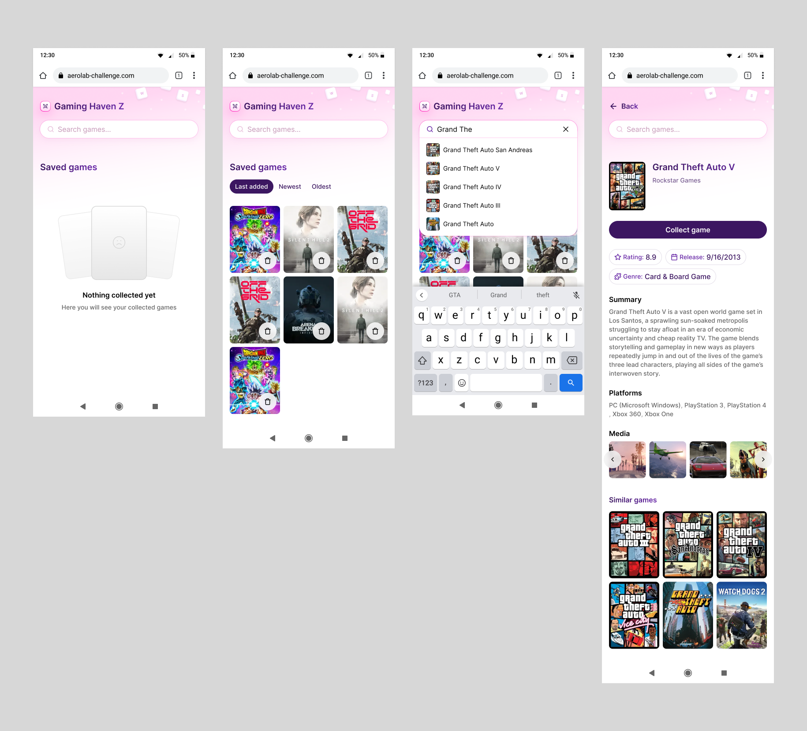

> [!TIP]
> Apply for [UI Developer here](https://aerolab.recruitee.com/o/ui-developer-ssr-sr) and for [Full-stack Developer here](https://aerolab.recruitee.com/o/semisenior-senior-javascript-developer)

# Aerolab Coding Challenge — Live Interview

> This is the **live, pair-programming version** of our challenge. For the take-home version, see the [`main` branch](https://github.com/Aerolab/frontend-developer-coding-challenge/tree/main).

* [Overview](#Overview)
* [Format](#Format)
* [Design resources](#Design-resources)
* [Tech Stack](#Tech-Stack)
* [Games API](#Games-API)
* [Requirements](#Requirements)
* [Evaluation](#Evaluation)

## Overview

Your task is to build a small web application that lets users search for video games and save them into a personal collection stored in the browser. We'll work on it together, live, during the interview.

The goal isn't to ship a complete product — it's to see how you think, how you make decisions, and how you collaborate with us (and with AI tools) to solve a problem under realistic conditions.

## Format

> [!IMPORTANT]
> This is a **pair-programming session**, not a solo exam. Think out loud, ask questions, push back on ideas — that's the point.

- ⏱ **Duration:** ~60–90 minutes of building, plus time to chat about the result.
- 🤖 **AI is welcome and encouraged.** Bring whatever AI tooling you already use day-to-day (Cursor, Claude Code, Copilot, ChatGPT, etc.). We want to see how you actually work in 2026.
- 💻 **You'll share your screen** and drive the keyboard. We'll be there to discuss tradeoffs, unblock you, and explore the problem together.
- 🎯 **Scope > polish.** Aim for a working, opinionated MVP. Anything you don't get to we can talk through verbally.

## Design resources

Below is a reference design with the four key screens (empty state, collection, search, detail). **Pixel-perfect matching is not the goal** in this format — capture the spirit of the design and prioritize a clean, responsive layout.



## Tech Stack

### Recommended
- `TypeScript`
- `Next.js` (App Router) — or another framework you're confident in; just let us know beforehand.
- `Tailwind CSS` or `CSS Modules`
- Any UI library you like: `shadcn`, `Radix`, `NextUI`, `MagicUI`, `MUI`.
- `Vercel` for deployment (optional in the live format).

> Use whatever libraries help you move faster. We care about decisions, not memorized APIs.

## Games API

To skip API setup and let us focus on building, we provide a small public API with a curated dataset of popular games. **No auth, no rate limits, no environment variables.**

**Base URL:** `https://aero-games-api.vercel.app`

### Endpoints

| Method | Path | Description |
| ------ | ---- | ----------- |
| `GET`  | `/api/games` | Returns the full list of games. |
| `GET`  | `/api/games?q={query}&limit={n}` | Search by name (case-insensitive, partial match). `limit` defaults to `10`. |
| `GET`  | `/api/games/{slug}` | Returns the full record for a single game by slug. Returns `404` if not found. |

### Response shape

`/api/games` returns:

```json
{
  "count": 20,
  "results": [
    {
      "id": 1942,
      "name": "The Witcher 3: Wild Hunt",
      "slug": "the-witcher-3-wild-hunt",
      "first_release_date": 1431993600,
      "rating": 93.8,
      "total_rating_count": 5266,
      "cover": { "url": "/images/coaarl.webp", "width": 600, "height": 800 },
      "screenshots": [{ "url": "/images/...webp" }],
      "platforms": [{ "name": "PC (Microsoft Windows)" }],
      "genres": [{ "name": "Role-playing (RPG)" }],
      "similar_games": []
    }
  ]
}
```

### Images

All image URLs are **relative paths** under the same host. Prefix with the base URL to display them:

```
https://aero-games-api.vercel.app/images/coaarl.webp
```

### Notes

- The dataset is small (~20 top-rated games) on purpose — enough to build a meaningful UX without dataset noise.
- `first_release_date` is a **Unix timestamp in seconds**.
- All fields are derived from the IGDB schema, so you can reference the [IGDB docs](https://api-docs.igdb.com/) for additional context if needed.

## The product

The reference design is the source of truth for what we want to build. It defines four screens that together describe a single product: an app where a user can search for games, save them into a personal collection, and review the details of any game they care about.

At a high level, the product should support the following experience:

- A user opens the app and finds their personal collection of saved games. If they haven't saved anything yet, the app communicates that clearly.
- The user can search the catalog and see relevant matches as they type, including cover art and title for each game.
- From a search result, the user can open a game's detail view to see its cover, rating, release date, platforms, summary, screenshots, and similar games.
- From either the search or the detail view, the user can add a game to their collection. The collection persists across reloads and renders as a grid of covers, with the option to sort it and to remove items from it.
- The whole experience is responsive and behaves well on mobile and desktop.

You decide how much of this you build during the session, and in what order. We don't expect a finished product — we expect a coherent slice of one. Anything you don't reach we'll discuss together.

## Evaluation

We're not grading a finished product. We're trying to understand:

- **How you reason.** Tradeoffs, scope decisions, what you choose to build first and why.
- **How you collaborate.** With us, and with your AI tools. Showing how you steer, verify, and correct AI output is a strong signal.
- **Code quality at speed.** Clean, readable code under time pressure. Naming, structure, types.
- **Product sense.** Does what you build feel good to use? Did you notice the small things?
- **Communication.** Thinking out loud, asking the right questions, knowing when to say "let's not bother with that now."

## Aerolab

Aerolab is a Digital Product Studio based in Buenos Aires, Argentina.

We design and develop top-tier websites and apps for startups and leading brands.

We are remote-first!

### 👩‍💻 Are you looking for a remote developer job?

We are open to work! We have remote positions for Frontend and Fullstack developers, plus Product Designers, Project Managers and more. Apply at https://aerolab.co/jobs

## Follow us!

- [Twitter](https://twitter.com/aerolab)
- [Instagram](https://www.instagram.com/aerolab/)
- [Dribbble](https://dribbble.com/aerolab)
- [Behance](https://www.behance.net/aerolab)
- [Linkedin](https://www.linkedin.com/company/aerolab-digital)

🪁
